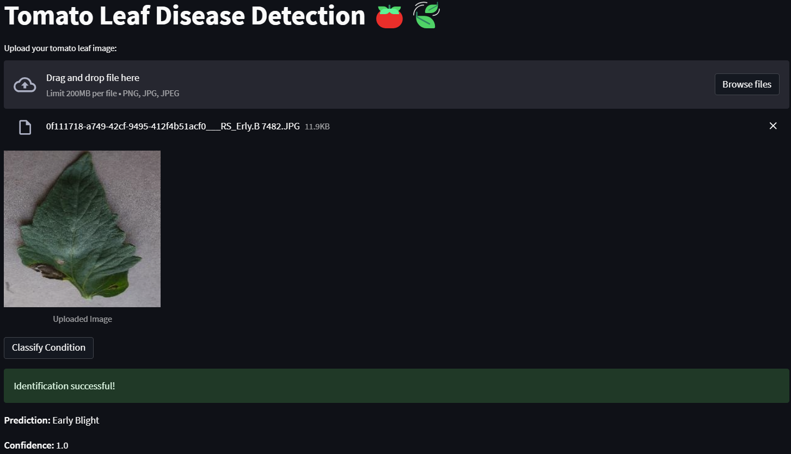

## 🎯 Project Description ##
Tomatoes are one of the most extensively grown vegetables in any country, and their diseases can significantly affect yield and quality. Accurate and early detection of tomato diseases is crucial for reducing losses and improving crop management.

In this project, I will be appllying the power of Deep Learning to detect and classify the various stages of blight in tomato leaves, making automation of disease detection more efficient and accessible.

## 📃 The Dataset ## 
The [dataset](https://www.kaggle.com/datasets/charuchaudhry/plantvillage-tomato-leaf-dataset/data) consists of 3 different folders, each containing images of tomato leaves with the respective syndroms:

- Healthy
- Early blight
- Late blight
  
## 📚 Project Structure ##
In my notebook I went through the following steps:
- ⚙️ Notebook Preparation - Import libraries, initialize constants and download dataset.
- 🔎 Data Exploration - Visualize data and confirm the distribution of different classes.
- 🪓 Data Splitting - Split data into Train, Validation and Testing sets.
- 🧹 Data Preprocessing - Load and preprocess images to ensure compatibility with neural networks.
- 🛠️ Model Building - Build a CNN model using TensorFlow.
- 📈 Model Training - Train model on the dataset, and use a separate validation set to monitor its performance.
- 📊 Model Evaluation - Evaluate the model's performance on a separate test set.
- 🔝 Model Improvement - Try different strategies to improve the model's performance.
- 🖼️ Result Visualization & Interpretation - Visualize the results.

After the final training of the model, I created a FastAPI instance and developed a Streamlit interface, that allows easy usage of the Tomato Leaf Disease Detection.

## 👨‍💻 Getting Started ## 
1. Clone the repository:
   ```bash
   git clone git@github.com:Kaaykun/TomatoLeafDisease.git
   cd TomatoLeafDisease
2. Create a virtual environment:
   ```bash
   pyenv local Tomato
3. Install the package dependencies:
   ```bash
   make install_package
4. Download Kaggle API token:<br>
   Go to the 'Account' tab of your [user profile](https://www.kaggle.com/settings/account) and select 'Create New Token'. This will trigger the download of kaggle.json, a file containing your API credentials.<br>
   Move the downloaded file into the following folder:<br>
   On Linux, OSX, and other UNIX-based operating systems:
   ```bash
   ~/.kaggle/kaggle.json
   ```
   On Windows:
   ```bash
   C:\Users\<Windows-username>\.kaggle\kaggle.json
   ```
5. Download the dataset:
   ```bash
   make download_data
6. Run the FastAPI instance:
   ```bash
   make run-fastapi
7. Run the Streamlit server:
   Open a new terminal window (as the previous terminal is now hosting the FastAPI server).
   ```bash
   make run-streamlit
